# DOCUMENTO DE PROPUESTA DE SOLUCIÓN Y PLAN DE IMPLEMENTACIÓN (EA2 / EA3)
## Rediseño y Optimización Omnicanal del Centro de Distribución Pudahuel — AndesHome Chile S.A.

**Asignatura:** GLA1104 | Taller de Logística y Cadena de Suministro  
**Metodología:** Basada en Desafíos (18 Semanas) | Evaluaciones EA2 y EA3  
**Destinatario:** Comité de Dirección & Directorio Ejecutivo — AndesHome Chile S.A.  
**Fecha de Emisión:** Octubre 2026  
**Autor:** Equipo Consultor de Logística y Cadena de Suministro  

---

> [!IMPORTANT]
> **RECOMENDACIÓN PARA EL DIRECTORIO:**
> Se recomienda la **aprobación inmediata** del Portafolio Combinado de Inversión ($\text{P1} + \text{P2} + \text{P3} + \text{P4} + \text{P5}$) por un **CAPEX Total de CLP 766.800.000** (incluyendo 8% de reserva de contingencia). La solución erradica las causas raíz del colapso operativo de Jun 2026, genera un **VAN de CLP 1.289.400.543**, una **TIR del 98,4%** y recupera la inversión en **10,7 meses**, estabilizando la operación **12 semanas antes del Peak Cyber 2027**.

---

## 1. Resumen Ejecutivo y Marco de Decisión Estratégica

### 1.1. Contexto de Urgencia Operativa
El Diagnóstico Operativo (EA1) evidenció un deterioro crítico en el Centro de Distribución Pudahuel (12.500 m²):
* **Caída del OTIF Global:** Del 92,3% (Jul 2025) al 80,9% (Jun 2026), alcanzando un mínimo del **43,5% en Peak Cyber** (11,5% en Click & Collect).
* **Backlog Acumulado:** 15.387 pedidos pendientes al 30 de Junio de 2026 (equivalente a 4,32 días de demanda continua desatendida).
* **Sobrecosto Operativo:** El costo por pedido despachado subió a **CLP 7.920** (+34,7%), mientras que cada pedido fallido cuesta **CLP 29.628** (+247% vs. cumplido).
* **Multas y Demurrage:** Multas por incumplimiento comercial (CLP 184,5M) y cobros por sobreestadía de camiones inbound (CLP 146,3M en 4 meses).

### 1.2. Portafolio Seleccionado vs. Alternativas Descartadas
De un universo de 7 iniciativas evaluadas (P1 a P7), se seleccionó el **Portafolio Integrado P1-P5**, fundamentado en la optimización de procesos, tecnología core y transporte:

| Iniciativa Evaluada | Descripción Breve | CAPEX (CLP) | OPEX / Año (CLP) | Decisión Estratégica | Justificación Téxnica |
| :--- | :--- | :---: | :---: | :---: | :--- |
| **P1: Re-slotting ABC + 5S + Conteos** | Reubicación física 114 SKU desalineados. | $85.000.000 | $12.000.000 | **SELECCIONADO** | Elimina 67,6 km/día de caminata inútil (Quick Win). |
| **P2: Upgrade WMS NextGen + Voice/RF** | Eliminación de papel y picking por voz. | $310.000.000 | $75.000.000 | **SELECCIONADO** | Eleva productividad +18% (46,8 a 55,2 lin/h). |
| **P3: Portal ASN & YMS Proveedores** | Agendamiento digital ventanas 2h. | $95.000.000 | $24.000.000 | **SELECCIONADO** | Reduce Dock-to-Stock de 22,6 h a 4,5 h. |
| **P4: TMS Ruteo Dinámico + POD** | Algoritmo volumen/peso y app chofer. | $150.000.000 | $48.000.000 | **SELECCIONADO** | Reduce fallidas de 11,5% a &le;3% en transporte. |
| **P5: Right-sizing & Ergonomía D-Bulky** | 6 cajas óptimas + mesas elevadoras. | $70.000.000 | $18.000.000 | **SELECCIONADO** | Elimina 38 SKU manuales >25kg (Cumplimiento DT). |
| **P6: Flota AMR / Cobots AGV** | Robots autónomos para picking. | $420.000.000 | $65.000.000 | **DESCARTADO** | Excede el techo de CAPEX ($1.130M total > $850M). |
| **P7: Planta Solar Fotovoltaica CD** | Paneles solares autoconsumo. | $180.000.000 | $8.000.000 | **POSTERGADO** | Menor retorno operativo directo; diferido a Fase 2. |

---

## 2. Matriz de Evaluación Multicriterio de Decisión (AHP / Scoring)

Para respaldar la decisión ante el Directorio, se evaluaron los portafolios alternativos bajo una matriz ponderada de 5 criterios estratégicos:

| Criterio de Evaluación | Ponderación (%) | Opción A: Solo Quick Wins (P1+P5) | Opción B: Portafolio Recomendado (P1-P5) | Opción C: Automatización AMR (P1-P6) |
| :--- | :---: | :---: | :---: | :---: |
| **Retorno Financiero (VAN / TIR / Payback)** | 30% | 6,5 / 10 | **9,5 / 10** | 4,0 / 10 |
| **Alineación con Causas Raíz (EA1)** | 25% | 5,0 / 10 | **9,8 / 10** | 8,5 / 10 |
| **Factibilidad Técnica y Restricción CAPEX** | 20% | 9,8 / 10 | **9,0 / 10** (CLP 766,8M &le; 850M) | 1,0 / 10 (Excede CAPEX) |
| **Plazo de Ejecución (&le; 36 Semanas)** | 15% | 10,0 / 10 (10 sem) | **9,2 / 10** (24 sem) | 4,0 / 10 (42 sem) |
| **Sustentabilidad Ergónomica y ESG** | 10% | 8,0 / 10 | **9,0 / 10** | 7,5 / 10 |
| **PUNTAJE PONDERADO FINAL** | **100%** | **7,26 / 10** | **9,25 / 10 (ÓPTIMO)** | **5,33 / 10** |

> [!NOTE]
> **Conclusión del Análisis Multicriterio:** El **Portafolio P1-P5** es la única combinación que resuelve el 100% de las causas raíz operativas respetando estrictamente el presupuesto máximo de CAPEX ($850M) y la ventana de tiempo antes del Peak Cyber 2027.

---

## 3. Análisis Económico-Financiero y Evaluación de Escenarios

### 3.1. Consolidado de Inversión y Beneficios
* **Subtotal CAPEX Directo:** CLP 710.000.000.
* **Reserva de Contingencia de Proyecto (8%):** CLP 56.800.000.
* **CAPEX TOTAL REQUERIDO:** **CLP 766.800.000**.
* **OPEX Anual Incremental (Licencias SaaS & Mantención):** CLP 177.000.000 / año.
* **Ahorro Operacional Bruto Anual:** **CLP 1.033.097.000 / año**.
* **EBITDA Neto Incremental Anual:** **CLP 856.097.000 / año**.

### 3.2. Análisis de Sensibilidad por Escenarios (3 Años)

$$\text{VAN} = -\text{CAPEX Total} + \sum_{t=1}^{3} \frac{\text{EBITDA Neto Incremental}}{(1 + r)^t}$$

| Escenario Evaluado | Hipótesis de Mercado / Captura | CAPEX Total (CLP) | EBITDA Anual (CLP) | VAN a 3 Años (r=12%) | TIR (%) | Payback Simple |
| :--- | :--- | :---: | :---: | :---: | :---: | :---: |
| **Caso Pesimista (-25% Captura)** | Captura de ahorros del 75% por retardo en adopción de RF en turno noche. | $816.500.000 | $597.822.750 | **$619.345.118** | **47,2%** | **16,4 meses** |
| **Caso Base (Target 100%)** | Cumplimiento del 100% de los ahorros proyectados en P1 a P5. | **$766.800.000** | **$856.097.000** | **$1.289.400.543** | **98,4%** | **10,7 meses** |
| **Caso Optimista (+15% Sinergia)** | Ahorro adicional por menor devolución comercial y tarifa carrier consolidada. | $766.800.000 | $1.011.061.550 | **$1.661.642.420** | **124,1%** | **9,1 meses** |

> [!TIP]
> **Resiliencia Financiera:** Incluso en el escenario más adverso (Caso Pesimista), el proyecto mantiene un **VAN positivo superior a CLP 619 Millones** y paga la inversión en menos de 1,5 años.

---

## 4. Arquitectura Tecnológica To-Be y Valor Agregado (VSM)

### 4.1. Arquitectura de Integración de Sistemas
```
                                 +---------------------------+
                                 |    ERP Corporativo (SAP)  |
                                 +-------------+-------------+
                                               |
                                (API REST / Interfaces JSON)
                                               |
           +-----------------------------------+-----------------------------------+
           |                                   |                                   |
 +---------v---------+               +---------v---------+               +---------v---------+
 |   WMS NextGen     |<------------->|  Portal ASN / YMS |               |    TMS Dinámico   |
 | (Slotting & RF/   |               |  (Proveedores/    |               | (Rutas & POD      |
 | Voice Picking)    |               |   Andenes)        |               |  Mobile Carrier)  |
 +---------+---------+               +-------------------+               +---------+---------+
           |                                                                       |
  (RF Scanners & Voice)                                                  (Driver App Mobile)
           |                                                                       |
 [Operadores CD Pudahuel]                                                [Carriers / Flota]
```

### 4.2. Flujo de Valor Futuro (VSM To-Be)

```mermaid
flowchart LR
    A["Inbound Programado<br/>(Portal ASN + Cita)"] -->|Espera: 12 min| B["Descarga & QC Exprés<br/>Proc: 45 min"]
    B -->|Putaway Dirigido RF| C["Almacenamiento Racks<br/>Dock-to-Stock: 4,5 h"]
    C -->|Inventario Exacto 99,5%| D["Picking Voice/RF<br/>Proc: 3,2 h"]
    D -->|Buffer Controlado: 25 min| E["Packing Right-Sizing<br/>Proc: 1,8 h"]
    E -->|Staging Preclasificado| F["Despacho & TMS Ruta<br/>Proc: 2,5 h"]
```


---

## 5. Plan de Implementación Maestro (WBS 24 Semanas)

```
CRONOGRAMA DE HITOS Y GATES DE CONTROL (24 SEMANAS)
+-----------------------------------------------------------------------------------+
| FASE 1: PREPARACIÓN Y LIMPIEZA DE DATOS (Sem 1 a 4)                               |
|   - Depuración maestro SKU (EAN, dimensiones, peso). Gate 1 Aprobación Directiva.  |
| FASE 2: QUICK WINS Y RE-SLOTTING FÍSICO (Sem 5 a 10)                              |
|   - Ejecución P1 Re-slotting ABC + 5S + Reparación mesas elevadoras D-Bulky.      |
|   - 🛑 [Semana 10: Freeze de TI Corporativo de 4 semanas].                        |
| FASE 3: DESARROLLO E INTEGRACIÓN TECNOLÓGICA (Sem 11 a 18)                         |
|   - Despliegue P3 Portal ASN, P4 TMS y P2 WMS NextGen en ambiente staging.        |
| FASE 4: PILOTOS Y CUTOVER POR ZONAS (Sem 19 a 22)                                 |
|   - Piloto A-Rápida con Voice/RF + Piloto Carrier LogiExpress en TMS.              |
| FASE 5: ESTABILIZACIÓN Y GO-LIVE GENERAL (Sem 23 a 24)                            |
|   - Cutover general sin detener el CD, certificación de superusuarios y handover.  |
+-----------------------------------------------------------------------------------+
```

---

## 6. Gobernanza, Matriz RACI y Gestión del Cambio (Modelo ADKAR)

### 6.1. Matriz RACI del Proyecto

| Entregable / Hito del Proyecto | Sponsor Exec | PMO / SC Mgr | Jefe CD | Jefe TI | Jefa Inbound | Jefa Transporte | Prevencionista |
| :--- | :---: | :---: | :---: | :---: | :---: | :---: | :---: |
| **Aprobación Presupuesto CAPEX ($766,8M)** | **A** | R | C | C | I | I | C |
| **Depuración Maestro SKU (P1)** | A | **R** | C | C | I | I | I |
| **Integración ERP-WMS-TMS (P2/P4)** | A | C | C | **R** | I | I | I |
| **Portal ASN Proveedores (P3)** | A | C | I | C | **R** | I | I |
| **Rediseño Ergónomico D-Bulky (P5)** | A | C | R | I | I | I | **A / R** |
| **Cutover General & Go-Live Final** | **A** | R | R | R | R | R | R |

### 6.2. Estrategia de Gestión del Cambio (Prosci ADKAR)
1. **Conciencia (Awareness):** Comunicación transparente sobre la erradicación del trabajo pesado manual y eliminación del papel.
2. **Deseo (Desire):** Sistema de incentivos vinculado a la precisión de picking con RF y reducción del esfuerzo físico.
3. **Conocimiento (Knowledge):** Formación intensiva de 18 superusuarios (2 por turno/área) en las semanas 15 a 18.
4. **Habilidad (Ability):** Acompañamiento en vivo durante los turnos de noche y refuerzo para personal temporal.
5. **Refuerzo (Reinforcement):** Auditorías semanales de adherencia a procesos WMS/RF y reconocimiento de mejores turnos.

---

## 7. Tablero de Control de KPIs y Garantía de Sustentabilidad

| Indicador KPI | Línea Base (Jun 2026) | Meta Directorio | Proyección Semana 24 | Frecuencia Control | Owner Responsable |
| :--- | :---: | :---: | :---: | :---: | :--- |
| **OTIF Global** | 80,9% | $\ge 96,0\%$ | **97,2%** | Semanal | Gerenta Supply Chain |
| **Exactitud Inventario (IRA)** | 93,8% | $\ge 99,2\%$ | **99,5%** | Quincenal | Jefe Inventario |
| **Dock-to-Stock** | 22,6 h | $\le 8,0\text{ h}$ | **4,5 h** | Diaria | Jefa Inbound |
| **Costo por Pedido** | CLP 7.920 | CLP 5.675 (-12%) | **CLP 5.420** | Mensual | Gerente Finanzas |
| **Ergonomía D-Bulky** | 38 SKU manuales | 0 SKU sin ayuda | **0 SKU (100%)** | Semanal | Prevencionista |

---

## 8. Acta Formal de Recomendación y Solicitud de Aprobación

Por intermedio del presente documento, el Equipo Consultor recomienda formalmente al Comité de Dirección de AndesHome Chile S.A. aproVisionar los fondos por **CLP 766.800.000** para iniciar la Fase 1 en la Semana 1.

```
__________________________________            __________________________________
GERENTE GENERAL                               GERENTA DE SUPPLY CHAIN
AndesHome Chile S.A.                          AndesHome Chile S.A.

__________________________________            __________________________________
GERENTE DE FINANZAS                           JEFE DE TECNOLOGÍA (TI)
AndesHome Chile S.A.                          AndesHome Chile S.A.
```
