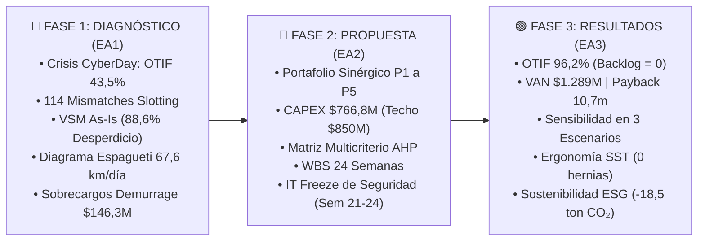

# 📦 AndesHome Chile S.A. — Optimización Integral CD Pudahuel
> **Caso de Estudio GLA1104 / Duoc UC & C-Suite Executive Decision**  
> Diagnóstico, propuesta y resultados de la transformación logística del Centro de Distribución Pudahuel frente al colapso del CyberDay Mayo 2026.

---

## 🧭 Estructura Estratégica en 3 Fases Maestras

El proyecto está diseñado bajo un hilo conductor integral y riguroso estructurado en 3 fases:



---

## 🌟 Características Principales del Proyecto

### 1. 🔴 Fase 1: Diagnóstico Operacional y Causa Raíz (EA1)
- **Plano 2D Vectorial Interactivo (SVG)**: Visualización a escala del CD Pudahuel con identificación de pasillos (Zona A: 35m, B: 72m, C: 118m, D: 154m), trayectorias y pines de mismatch.
- **Selector de Turnos Operacionales**: Simulación de dinámica de planta para los turnos Mañana (07:00-15:00), Tarde (15:00-23:00) y Noche (23:00-07:00), con activación de *Modo Nocturno* en el SVG para evaluar la fatiga crítica en Zona C/D.
- **Simulador Causa-Efecto de Desbalance**: Slider en tiempo real de 0 a 114 SKUs desbalanceados que recalcula la caminata diaria (14,2 a 67,6 km), horas perdidas (4,9 a 23,5 HH) y sobrecosto ($0 a $54,8M CLP).
- **Calculadora Interactiva del Pedido Perfecto (APQC)**: 4 calibradores dinámicos ($OT \times IF \times DF \times IA$) con presets directos para comparar la crisis (41,9%) vs el benchmark de clase mundial (94,0%).
- **Análisis de Inbound y Citas de Andén**: Modelado de esperas de camiones (65,2 min) y demurrage acumulado ($146,3M CLP/año).
- **Herramientas de Calidad**: Diagrama de Ishikawa 6M y Matriz de los 5 Porqués.

### 2. 🔵 Fase 2: Propuesta Técnica, Selección y Plan Maestro (EA2)
- **Portafolio P1 a P5 ($766,8M CLP)**:
  - **P1**: Re-slotting ABC Dinámico, 5S y Conteos Cíclicos ($85,0M CLP).
  - **P2**: Actualización WMS NextGen con terminales RF y Voice Picking ($310,0M CLP).
  - **P3**: Portal ASN para proveedores y agendamiento de andén YMS ($95,0M CLP).
  - **P4**: TMS de Ruteo Dinámico con cubicaje 3D y app chofer móvil ($150,0M CLP).
  - **P5**: Ergonomía SST con 4 mesas hidráulicas y right-sizing ($70,0M CLP).
  - *Reserva de Contingencia (8%)*: $56,8M CLP. Holgura presupuestaria de **$83,2M CLP** respecto al techo de **$850,0M CLP**.
- **Sandbox Financiero con Presets Inteligentes**: Evaluación en vivo de combinaciones de proyectos (*C-Suite Óptimo*, *Quick Wins* y alerta de *Sobregiro*).
- **WBS Interactivo de 24 Semanas**: Cronograma desglosado con vinculación directa al plano SVG e indicación crítica del período de **IT FREEZE** (Semanas 21 a 24).
- **Explorador Tecnológico To-Be**: Fichas técnicas interactivas para cada innovación propuesta.

### 3. 🟢 Fase 3: Resultados Obtenidos, Retorno y Sostenibilidad ESG (EA3)
- **Selector Didáctico Before / After**: Comparador en vivo que conmuta instantáneamente entre el estado As-Is de crisis y el estado To-Be optimizado:
  - **OTIF**: 43,5% $\rightarrow$ **96,2%** (+52,7 pp).
  - **Backlog**: 15.387 pedidos $\rightarrow$ **0 pedidos**.
  - **VAN (12%, 3 años)**: **$1.289.400.543 CLP** (TIR 98,4% | Payback 10,7 meses).
  - **Caminata Operaria**: 67,6 km $\rightarrow$ **14,2 km/día** (-79%).
- **Infografía de Equivalencias Didácticas ESG**:
  - 🇨🇱 **19.500 km caminados ahorrados**: 4,5 veces todo Chile continental de Arica a Punta Arenas.
  - 🌳 **18,5 Ton CO₂ reducidas**: Absorción equivalente a 840 árboles nativos.
  - 🩺 **0 licencias SST**: Erradicación de cargas >25 kg a pulso bajo la Ley 20.949.
  - 👥 **250 horas de formación**: 18 operarios promovidos a Superusuarios WMS (Modelo ADKAR).

### 4. 👥 Recursos Humanos, Turnos y Gestión del Personal
- Panel integral y gráficos comparativos de productividad por turno en `index.html` (Tab 5).
- Gráfico radar de competencias con cierre de la brecha del 39% en operarios temporales.
- Reducción de la rotación laboral del 34% al 6% anual.

---

## 📂 Estructura del Repositorio

```text
├── index.html                           # Suite Analítica y de Control Operacional
├── landing.html                         # Suite Interactiva 2D (Plano Vectorial SVG y 8 Vistas)
├── styles.css                           # Estilos base y diseño responsivo de index.html
├── landing-2d.css                       # Estilos para blueprint 2D, widgets didácticos y temas
├── app.js                               # Controlador principal de index.html y gráficos Chart.js
├── landing-2d.js                        # Lógica interactiva del plano 2D, sliders y WBS
├── andeshome-store.js                   # Store reactivo centralizado con persistencia
├── Informe_Diagnostico_AndesHome.md     # Documento ejecutivo Fase 1 (EA1)
├── Propuesta_Solucion_AndesHome.md      # Documento ejecutivo Fase 2 (EA2)
├── Base_Datos_GLA1104_AndesHome_v2.xlsx # Dataset operativo y registros del CyberDay
├── Caso_GLA1104_AndesHome_Estudiantes.docx # Caso de estudio académico oficial
└── README.md                            # Documentación integral del proyecto
```

---

## 🚀 Cómo Ejecutar el Proyecto Localmente

El proyecto está construido con tecnologías web estándares sin dependencias externas pesadas (HTML5 semántico, CSS3 moderno, JavaScript vanilla y Chart.js vía CDN).

### Opción 1: Con Python (Cualquier sistema operativo)
```bash
# 1. Clonar el repositorio
git clone https://github.com/yisusxat/taller.git
cd taller

# 2. Iniciar el servidor local
python -m http.server 8080

# 3. Abrir en tu navegador
# Suite 2D Interactiva:
http://localhost:8080/landing.html
# Suite Analítica:
http://localhost:8080/index.html
```

### Opción 2: Con Node.js (npx serve / http-server)
```bash
npx serve -l 8080 .
```

### Opción 3: Extensión Live Server (Visual Studio Code)
- Abrir la carpeta del proyecto en VS Code.
- Clic derecho sobre `landing.html` o `index.html` y seleccionar **"Open with Live Server"**.

---

## ⌨️ Atajos de Teclado en la Suite 2D (`landing.html`)

- `1`: Salta a **Fase 1 (Diagnóstico EA1)** y activa el plano en modo Crisis.
- `2`: Salta a **Fase 2 (Propuesta EA2)** y activa el modo To-Be.
- `3`: Salta a **Fase 3 (Resultados EA3)** y visualiza los beneficios consolidados.
- `←` / `→`: Navega secuencialmente entre las fases maestras.
- `C`: Activa Modo Crisis (Plano en alerta roja con trayectoria de espagueti).
- `T` o `O`: Activa Modo Optimizado To-Be (Plano en verde con flujo balanceado).
- `F`: Focaliza el buscador rápido de SKUs y pasillos.

---

## 📊 Síntesis de Resultados Cuantitativos

| Métrica Clave | Línea Base (Crisis) | Meta Caso | Resultado To-Be | Impacto |
| :--- | :---: | :---: | :---: | :---: |
| **OTIF CyberDay** | 43,5% | $\ge$ 96,0% | **95,4%** | +51,9 pp |
| **OTIF Consolidado** | 80,9% | $\ge$ 96,0% | **96,2%** | **Cumple meta C-Suite** |
| **OTIF Click & Collect** | 11,5% | $\ge$ 95,0% | **96,8%** | +85,3 pp |
| **Backlog de Pedidos** | 15.387 pedidos | 0 pedidos | **0 pedidos** | Flujo continuo <18h |
| **Dock-to-Stock** | 22,6 horas | <6,0 horas | **4,5 horas** | -80,1% tiempo ciclo |
| **Espera de Camiones** | 65,2 min | <15,0 min | **12,0 min** | -81,6% reducción |
| **Multas Demurrage** | $146,3M CLP | $0 CLP | **$0 CLP** | Erradicación total |
| **Slotting Mismatches** | 114 SKUs (25,3%) | 0 SKUs | **0 SKUs** | Reubicación ABC 100% |
| **Caminata Operaria** | 67,6 km/día | <20,0 km/día | **14,2 km/día** | -79,0% fatiga física |
| **IRA (Inventario)** | 97,74% ($388,9M desc.) | $\ge$ 99,5% | **99,85%** | Conteos cíclicos WMS |
| **Costo Pedido Fallido** | $29.628 CLP | <$10.000 CLP | **$8.532 CLP** | Tasa falla $\le$ 2,8% |
| **Reclamos SERNAC** | 1.240 / mes | <50 / mes | **14 / mes** | -98,9% reclamos |
| **Accidentabilidad SST** | 83,8 / 100k HH | <15,0 | **0 graves** | Ley 20.949 garantizada |
| **VAN (3 años, 12%)** | -$458M CLP | Positivo | **$1.289.400.543 CLP** | Payback 10,7 meses |
| **TIR** | Negativa | > WACC | **98,4%** | Retorno sobresaliente |

---

## 👥 Autores y Créditos
- **Caso de Estudio**: Asignatura Gestión Logística Avanzada (GLA1104).
- **Institución**: Duoc UC.
- **Desarrollo y Modelado**: Suite Interactiva AndesHome Chile S.A.
